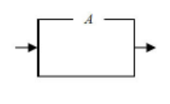
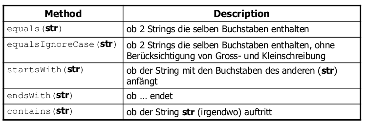
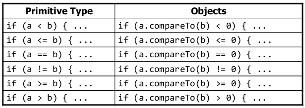

# Einführung in die Programmierung

[TOC]


## Riassunto/note su aspetti da ricordare

### EBNF

- la sequenza delle regole non ha rilevanza (**Menge** von Regeln)
- *Linke Seite* (*LHS*) <= *Rechte Seite* (*RHS*)
  - *digit_9* <= 9 oppure <digit_9> <= 9
- {} = *geschweifte Klammer*

#### Tabella

1. sostituire il nome (LHS) con la definizione (RHS)
2. Scegliere un'alternativa
3. Decidere se un elemento opzionale c'è oppure no
4. Determinare il numero di ripetizioni

#### *Ableitungsbäume*

- sopra: LHS
- sotto (per ogni livello): RHS

#### Caratteri speciali

Scrivere i caratteri speciali

- opzione 1: incorniciarli
- opzione 2: mettere tra virgolette $\rightarrow$ "" per utilizzare le virgolette come simbolo speciale

#### Equivalenza fra due regole

B~1~ and B~2~ sono equivalenti sse:

-  legale per B~1~ $\iff$ legale per B~2~
-  illegale per B~1~ $\iff$ illegale per B~2~

#### Rappresetazione grafica

| Option                                                       | Wiederholung                                                 | Auswahl                                                      |
| ------------------------------------------------------------ | ------------------------------------------------------------ | ------------------------------------------------------------ |
| `[A]`                                                        | `{A}`                                                        | `A | B | C | D `                                             |
|  |  |  |

#### Recursione in *Ableitungsbaum*

Esempio `r <= b | Ar`:

 $\implies$ AAB è legale

### Java

#### *Keyword* che non possono essere usate come *Bezeichner*

```java
abstract	default		if				private			this
boolean		do			implements		protected		throw
break		double		import			public			throws
byte		else		instanceof		return			transient
case		extends 	int				short			try
catch		final		interface		static			var
char		finally		long			strictfp		void
class		float		native			super			volatile
const		for new		switch			while
continue	goto		package			synchronized
```

####  Caratteri speciali

- `\t` tabulazione

- `\n` nuova riga

- `\"` doppie virgolette

- `\\` backslash

  **N.B.:** Lo slash normale (`/`) non dà problemi.

#### Metodi

L'utilizzo della parola `static` davanti al metodo permette di chiamarlo senza l'utilizzo dell'oggetto, esempio: 

```java
public class PrintExample2 {
    public static void main(String[] args) {
        printWarning();
        System.out.println("Lange Erklaerung");
        printWarning();
    } // main
    public static void printWarning() {
        System.out.println("\n--------\n");
        System.out.println("Warnung: sichern Sie die Daten\n");
        System.out.println("\n--------\n");
    }
}
```

#### *Primitive types*

 

**(non da sapere)**

+`float`, utilizzato per salvare memoria con numeri reali

+`short` *data type* a 16-bit 

+`byte` *data type* a 8-bit

| Tipo e range |         `int`         |              `long`              |
| ------------ | :-------------------: | :------------------------------: |
| Da           | $-2^{31}=-2147483648$ | $-2^{63} = -9223372036854775808$ |
| A            | $2^{31}-1=2147483647$ | $2^{63}-1= 9223372036854775807$  |

**Per il `long`** **bisogna usare la lettera `L`** **alla fine del numero per dichiararlo correttamente.**

####  Operazioni

**Attenzione al modulo!** Alcuni casi particolari:

```java
-1%2; // fa -1, non 1!!
1%7; // fa 1
230857%10; // fa 7, in generale, %10^n è utile per ottenere le ultime n cifre di un numero.
230857%2; // fa 0, in generale, %2 è utile per vedere se un numero è pari.
2.5%1.5; // fa 1.0 (double)! % è definito anche per i double!
```

#### Scanner

Lo scanner si trova in `java.util.*` .

Come creare un nuovo scanner con l'input della console:

```java
Scanner name = new Scanner(System.in);
```

#### Incremento e decremento

 Post-Inc/Decrement

Pre-Inc/Decrement

```java
int x=2;
int y;
y=++x; //*
```

Succede che:

```java
//*: 
x=x+1;
y=x;
```

#### *off-by one* error, o *Zaunpfahlproblem*

Esempio: `1, 2, 3, 4, 5,`, oppure `,1 ,2 ,3 ,4, 5`

#### Stringhe

`s.toUppercase` ritorna la stringa in caps-lock, ma non la sostituisce (`s` rimane in minuscolo).

 

#### Classe `Random`

`java.util.Random`:

 

#### *Scope (Sichtbarkeitsbereich)* = "zona" di visibilità delle variabili

Le variabili sono visibili all'interno del blocco da cui sono delimitate (`{ //BLOCCO }`)

Alcune conseguenze: 

```java
for (int i = 1; i <= 100; i++) {
	System.out.print("/");
}
for (int i = 1; i <= 100; i++) { // OK
	System.out.print("\\");
}
int i = 5; // OK: outside of loop's scope
```

#### Array

`new int[number]` viene inizializzato a `0`, `new String[number]` (e in generale tutti gli oggetti) a `null`.

Per confrontare due array sia `.equals()` , che `==` non possono essere utilizzati. In compenso si utilizza `Arrays.equals(a1,a2)` della classe `java.util.Arrays`!

`Arrays.toString(a)` converte l'array `a` in una stringa.

È anche possibile creare un array di dimensione 0: ` int[] a = new int[0]`.

#### Value Semantics vs. Reference Semantics

Attenzione al fatto che il nome della variabile serve solo ad accedere all'oggetto, non è l'oggetto in se, ad esempio:

```java
int[] myArray = new int[] {0,1,2};
myArrayCopy = myArray;
myArray = null;
// myArrayCopy è ancora {0,1,2}, mentre:
myArray = myArrayCopy;
myArray[1]=18;
// myArrayCopy e myArray sono {0,18,2}
```

Inoltre le modifiche che avvengono all'interno di un altro blocco di codice restano visibile anche dopo, a differenza delle normali variabili. Ad esempio:

```java
public static void main(String[] args) {
    int[] myArray = {0,1,2};
    int k = 1;
	changeMyArray(myArray,k);
    // myArray è {0,18,2}, mentre k è sempre 1
}

public static void changeMyArray(int[] input, int number) {
    input[1] = 18;
    number = 39;
}
```

#### Classi e oggetti

Per confrontare due oggetti si usa `.equals()` e non `==` !!

Le variabili si riferiscono agli oggetti, pertanto sono delle *Referenzvariable* (*reference variable*), vedi sopra.

`null` serve per eliminare il riferimento di una variabile ad un oggetto (qualsiasi oggetto, ad es. stringa, o anche array). $\implies$ `NullPointerException`!

##### Clienti

> Klienten sind alle die Programme die Exemplare einer Klasse erstellen oder auf Exemplare zugreifen (können) [z.B. weil sie als Parameter übergeben wurden] 

##### Parametro implicito

> Impliziter ("implicit") Parameter: Das Objekt für das die Methode aufgerufen wird.

Ad esempio in `a.update()`, `a` è il parametro implicito.

##### Il metodo `toString()`

Serve per definire come convertire l'oggetto in una stringa. Di default indica l'indirizzo dell'oggetto nella memoria.

##### Costruzione e inizializzazione degli oggetti

Un costruttore ha la seguente struttura (non va specificato il tipo di output!):

```java
class Foo {
	public Foo(TypeOne ParamOne, TypeTwo ParamTwo [,...]) {
		// code in the constructor
	}
}
```

**N.B.: **le variabili vanno dichiarate all'esterno del costruttore, altrimenti sono visibili solo all'interno di esso.

##### `this`

`this` si può utilizzare, sia per evitare il *Verdecken von Variablen* (*shadowing*) (quando una variabile all'inteno di un oggetto ha lo stesso nome di un parametro), sia per chiamare il costruttore, attraverso `this()`. Questo può essere utile ad esempio per riutilizzare un costruttore in un'altra variante senza parametri, evitando la ridondanza, ad esempio:

```java
public class Point {
    private int x;
    private int y;
    public Point() {
        this(0, 0); // calls (x, y) constructor
    }
    public Point(int x, int y) {
        this.x = x;
        this.y = y;
    }
    ...
}
```

##### I metodi `static`

I metodi `static` non si riferiscono a un oggetto, ma alla classe. Ad es: `Class.method()` per uno  `static method`. 

Si utilizzano soprattutto per evitare la ridondanza in diverse classi (si evita di doverli ridefinire).

##### Variabili `static`

Funzionano in modo analogo ai metodi, ma **bisogna fare attenzione** nel loro utilizzo.

Le variabili `static` sono uguali per ogni oggetto della classe!

Le variabili `static` devono anche essere o `private` o `final`.

#### Manipolare file

La classe `File` (`java.io.File`) permette di operare sui file. Ecco una lista di metodi:

 

Per leggere il contenuto di un file di testo si può dare l'oggetto nel parametro di costruzione dello scanner:

```java
import java.io.*; // für File
import java.util.*; // für Scanner

File file = new File("input.txt");
Scanner scanner = new Scanner( file );
int zahl = scanner.nextInt();
```

#### Eccezioni (*Exception*)

Le eccezioni possono venire "catturate" (attraverso un *`catch`*, vedi più sotto), in modo da poter decidere come far reagire il programma in caso questo avvenga.

Certe eccezioni devono venir "catturate" dal programma, in quanto il sistema di Java non è in grado di trattarle correttamente. Altre sono riconosciute dal sistema (ad es. divisione per 0, `null`pointer,...).

Quest'ultime (riconosciute e gestite) sono dette ***checked Exception***, le altre sono dette ***unchecked Exception***.

Si può dichiarare il possibile verificarsi di un'eccezione all'interno di un metodo aggiungendo la *keyword* `throws` quando si dichiara il metodo:

```java
public static void foo(...) throws type
```

#### Input/Ouput

Scanner ha due eccezioni: `NoSuchElementException` e `InputMismatchException`.

Si può usare `.hasNext[Type]()` per verificare se c'è un elemento subito dopo dove si trova il cursore.

Lo scanner può essere anche utilizzato con una stringa come parametro. Questo può essere molto utile per trattare singolarmente ogni linea  (attraverso `.nextLine()`) di un file di testo. Es.:

```java
String text = "15 3.2 hello 9 27.5";
Scanner scan = new Scanner(text);
```

##### Output - la classe `PrintStream`

Si trova in `java.io`.

Funziona in modo simile alla console, ma utilizza dei metodi come in `System.out` per poter scrivere su un file. Ecco un esempio:

```java
import java.io.*;

File file = new File("example.txt");
PrintStream output = new PrintStream(file);
output.print("Hello world!");
```

**N.B: ** 

1.  Se il file esiste, viene sovrascritto.

2. Non utilizzare lo stesso scanner sia per i *Token* che per le righe, c'è il rischio di ottenere delle stringhe vuote come risultato. Esempio:

   ```java
   input.nextInt(); // output: 23
   "23\t3.14\nJoe\t\"Hello\" world\n\t\t45.2 19\n"
      ^
   input.nextDouble(); // output: 3.14
   "23\t3.14\nJoe\t\"Hello\" world\n\t\t45.2  19\n"
            ^
   input.nextLine(); // output: "" (empty!)
   "23\t3.14\nJoe\t\"Hello\" world\n\t\t45.2  19\n"
              ^
   input.nextLine(); // output: "Joe\t\"Hello\" world"
   "23\t3.14\nJoe\t\"Hello\" world\n\t\t45.2  19\n"
                                    ^
   ```

#### Salvataggio delle variabili 

- lo ***static data*** contiene informazioni per la macchina virtuale di Java (non rilevanti per il programmatore e non c'entra nulla con la *keyword* `static`)
- l'***heap*** contiente gli oggetti che vengono creati attraverso l'operatore `new`
- lo ***stack*** contiene le variabili utilizzate nei metodi (ad esempio anche i parametri)

 Lo *stack* cresce verso l'alto, mentre l'*heap* verso il basso.

##### Esempio

```java
public void run() {
    Rational a = new Rational(1, 2);
    Rational b = new Rational(1, 3);
    Rational c = new Rational(1, 6);
    Rational sum = a.add(b).add(c);
    println(a + " + " + b + " + " + c + " = " + sum);
}
```

 

Se ci sono troppe variabili/oggetti, lo stack e l'heap rischiano di sovrascriversi. Java restituisce in questo caso un errore (`StackOverflowError`, spesso avviene quando ci sono troppe ricorsioni).

Se ci sono delle zone della *heap* che non vengono puntate dallo *stack*, il *garbage collector* libera queste zone.

#### *Package*

Se si fa l'analogia della classe con il file, il pacchetto (*package*)  rappresenta la cartella.

Ad esempio una classe `D` nel pacchetto  `a.b.c` va salvata nel file `a/b/c/D.java`.

Se non viene specificato nessun pacchetto, Java inserisce automaticamente nel  pacchetto *default*, dal quale le classe non possono essere importate e non possono essere usate in altri *package*.

In queste lezioni viene utilizzato solo il *package default*. 

##### *Default* (visibilità)

Utilizzando la *keyword* `default`, il pacchetto sarà visibile solo all'interno della classe e  tutte le altre classi all'interno dello stesso pacchetto. Per avere *default* semplicemente non si scrive niente davanti alla dichiarazione della variabile. Ad esempio:

```java
package pacman.model;
public class Sprite {
    int points; // default: visible to pacman.model.*
    String name; // default: visible to pacman.model.*
}
```

##### *Nested classes*

Si possono creare delle classi all'interno di altre classi, ad esempio:

```java
public class Inner2 {
    public static void main(String[] args) {
        System.out.println(new InnerClass().foo);
    }
    static class InnerClass {
        int foo = 2;
    }
}
```

####  *Vererbung* (ereditarietà)

La *keyword* `super` si può utilizzare per riferirsi alla "classe madre" ad esempio `super.getSalary()` all'interno di `Administrator extends Angestellte` chiama `Angestellte.getSalary()`.

##### Costruttori

Quando si definisce un costruttore nella *superclass*, bisogna farlo canche per le *subclass*. **Le *subclass* non ereditano i costruttori**.

Il costruttore della *superclass* si può chiamare attraverso `super(...)`.

I `private` della *superclass* **non** possono essere letti dalla *subclass*! Per accedervi occorre utilizare degli appositi metodi e richiamarli poi con un `super.get...()` (oppure usare `protected`, vedi più sotto).

##### *Selektiv Verhalten (von Objekten)*

L'*override* si può sfruttare per cambiare il comportamento di un metodo che viene utilizzato all'interno di un altro metodo nella *subclass*. Ad esempio:

```java
public class Angestellte {
    private int years;
    public Angestellte(int initialYears) {
        years = initialYears;
    }
    public int getVacationDays() {
        return 20 + getSeniorityBonus();
    }
    // vacation days given for each year in the hospital
    public int getSeniorityBonus() {
        return 2 * years;
    }
}


public class FaGe extends Angestellte {
    public FaGe(int years) {
        super(years); 
    }
    // FaGe don't get extra vacation for their years of service.
    @Override
    public int getSeniorityBonus() {
        return 0;
    }
}
```

In questo caso chiamando attraverso un oggetto `FaGe`  `faGe.getVacationDays()`, `getSeniorityBonus()` dà `0`.

Questo fenomeno si chiama *dynamische Bindung* (*dynamic binding*).

##### L'attributo `protected` 

Questo attributo permette di alle *subclass* di accedere alle variabili della  *superclass*, mantenendo però la proprietà dell'attributo `private` di rendere inaccessibili le variabili dall'esterno della classe.

##### Gerarchia negli errori


##### La classe `Object`

Qualsiasi  classe che viene definita ha come *superclass* la classe `Object`.

All'interno della classe `Object` è definito il metodo `equals` che si può sovrascrivere con la classe che viene utilizzata in modo da poter verificare se due oggetti sono uguali. Ad esempio:

```java
public boolean equals(Point other) {
	return (x == other.x && y == other.y);
}
```

 Vi è però il problema che questo metodo può prendere in considerazione come parametro solo un oggetto di tipo `Point`. Per questo ci serve il ***cast***.

##### *Cast*

Il *cast* ci permette di cambiare (se c'è la giusta relazione "madre/figlio" fra le due classi) la classe.

Per verificare se il *cast* è possibile, si utilizza l'operatore `instanceof`. Se l'output è `true`, allora è possibile effettuare il *cast*.

Quando con un *cast* si passa da una *subclass* a una *superclass* il cast può anche essere implicito. Ad esempio:

```java
class A {}
class B extends A {}

A b = new B();
B x;
x = b; // Non funziona! Il cast va verso la subclass, pertanto dev'essere esplicito
x = (B) b; // Corretto
b = (A) x; // Corretto, ma non necessario esplicitare il cast
b = x; // Corretto (implicito)

```

#### Polimorfismo (*Polymorphismus*)

Un programma è sviluppato in modo che si possa utilizzare per diversi tipi di oggetti e che adatti il suo comportamento in base alle questi diversi tipi.

##### Visibilità delle classi

Se inserita la *keyword* `public` prima di `class` la classe deve trovarsi in un file con lo stesso nome della classe. Se questa *keyword* non viene inserita la visibilità sarà *default*, quindi visibile solo all'interno del pacchetto.

##### *dynamische Bindung* 

Se definisco una variabile di riferimento come `SuperClass variable = new SubClass()`, posso accedere a tutti i metodi definiti nella *superclass*, ma verranno eseguiti come definiti all'interno della *subclass*. Questo avviene se i metodi non sono in visibilità `private`. Esempio:

```java
class T {
    void s0(){ 
        m();
    }
    void s1(){}
    void s2(){}
    void m(){}
}

class S extends T {
    @Override
    void s1() {
    	m();
    }
    @Override
    void s2() {
    	p();
    }
    void p() {
        System.out.print("S");
    }
}

class R extends S {
    @Override
    void p() { 
        System.out.print("R");
    }
}
```

Se ad esempio definisco `T r = new R()`, chiamando `r.s2()` ottengo `R`, perché viene utilizzato `s2()` come definito in `S` e `p()` come definito in `R`. **N.B.** che `r.p()` non può essere chiamato perché `p()` non è definito in `T`.

Se i due metodi `p()` diventano `private`,  il risultato sarà **`S` e non `R`**! Questo perché `p()` di `R` non è visibile per `S`.

Per fare l'*override* di un metodo, tale metodo deve essere uguale o meno restrittivo del metodo nella *superclass*, altrimenti si ottiene un errore.

##### *Shadowing*

A differenza dei metodi, le variabili non vengono sostituite sempre. In genere il metodo prende le variabili come definite all'interno della classe stessa. In generale è sconsigliato riutilizzare le variabili con lo stesso nome all'interno delle *subclass*. Ecco un esempio:

```java
class X {
	String s = "in X";
    String myS() {
    	return s;
    }
    
    String myS1() {
        return s;
    }
}

class Y extends X {
    String s = "in Y";
    @Override
    String myS() {
  	  return s;
    }
}

Y yref = new Y();
yref.s; 					// da "in Y"
yref.myS(); 				// da "in Y"
yref.myS1(); 				// da "in X"
((X) yref).myS(); 			// da "in Y"
((X) yref).s; 				// da "in X"

```

#### *Interfaces*

Problema dell'ereditarietà (`extends`) è che ogni *subclass* può avere solo una *superclass*.

Questo problema è risolto dalle *interfaces*. Esse rappresentano (a differenza dell'ereditarità) dei comportamenti simili tra classi (stessi metodi).

Quando un metodo viene implementato, **deve** avere la visibilità **`public`**!!

Se una classe non implementa tutti i metodi dichiarati nell'*interface* si ottiene un errore. Se però si vuole lasciare la classe in questo modo è possibile farlo definendo la classe come `abstract` (`public abstract class ...`).

È possibile anche fare un `extend` di un'*interface* con un'altra *interface*.

##### *Overloading*

L'*overloading* permette di definire più metodi con lo stesso nome ma con parametri differenti, in modo che il metodo corretto venga chiamato a dipendenza dei parametri inseriti nella chiamata del metodo. Ecco un esempio:

```java
class A {
    String foo(X xref) {
    	return "foo 0 A";
    }
}
class B extends A {
    String foo(X xref) {
        return "foo 0 B";
    }
}
class C extends B {
    String foo(Y yref) {
    	return "foo 0 C";
    }
}

A a = new A();
B b = new B();
C c = new C();
X x = new Y();
Y y = new Y();

a.foo(y); //foo 0 A, siccome Y extends X
b.foo(x); //foo 0 B
c.foo(x); //foo 0 B!! Siccome in C prende come parametro una classe Y, non puo prendere x (cast esplicito necessario), quindi viene eseguito foo dalla classe B che prende come parametro una variabile della classe X.
```

#### *Exceptions*

**Attenzione** all'ordine dei blocchi `catch`. Vanno messi in modo che le eccezioni più "restrittive" siano all'inizio e quelle più generali alla fine.

##### *Generische Programmierung*

Per ogni *Basistyp* esiste una rispettiva classe chiamata *wrapper class* (*Wrapper Klasse*), che si ottiene scrivendo la prima lettera maiuscola (ma **`Character`** per `char` e **`Integer`** per `int`!).

Il cambiamento da *Basistyp* al rispettivo *wrapper* è automatico e viene definito come *boxing*.

Un nuovo oggetto di tipo `Integer` può essere creato utilizzando il metodo `valueOf(int number)`, ad esempio `Integer i = Integer.valueOf(5)` crea un `Integer i`  di valore `5`. È possibile ottenere il valore di un oggetto `Integer` attraverso i metodi `intValue()` o `doubleValue()`.

##### `compareTo()`

`compareTo()` permette di confrontare gli oggetti definendo un ordine (order relation, vedi DiskMat). Il valore restituito è minore o maggiore di `0` o uguale a `0`  a dipendenza dell'ordine dei due oggetti (o se sono uguali).



Per ordinare una *collection* si può utilizzare il metodo `sort()` della classe `Collections`  ( dove vi sono altri metodi utili per trattare le *collection*). Questo metodo può esser utilizzato sse. è definito il metodo `compareTo()` dell'interfaccia `Comparable` all'interno della classe del tipo di *collection*. In altre parole, una `Collection<E>` deve implementare `Comparable`, definendo il rispettivo metodo `compareTo(E other)`. In questo modo sarà possibile usare `Collection.sort()`.

A volte per fare un confronto può essere utile fare una sottrazione fra due valori, ma bisogna fare attenzione nel caso questi siano `double`, in tal caso meglio usare `Math.signum(double)`.

`compareTo()` è *konsistent* se $\forall$ `a`, `b`: `((a.compareTo(b)==0)==(b.compareTo(a)==0))`. Il consiglio è di averlo sempre *konsistent*.

##### `Collections` framework 

Tre importanti interfacce principali: `List`, `Map` e `Set`.


Vantaggi e svantaggi fra le diverse implementazioni

| ADT    | Implementazione                                              | Ordine                                                       | Vantaggi                                                     | Svantaggi                                                    |
| ------ | ------------------------------------------------------------ | ------------------------------------------------------------ | ------------------------------------------------------------ | ------------------------------------------------------------ |
| `List` | `ArrayList`  <br /><br /><br /><br /><br /><hr />`LinkedList` | come inseriti<br /><br /><br /><br /><br /><hr /> come inseriti | L'accesso ad un elemento (`get()`, `set()`, ...) avviene in $\mathcal{O}(1)$ <br /><br /><hr>L'aggiunta di un elemento all'inizio della lista avviene in $\mathcal{O}(1)$ | L'aggiunta di un elemento all'inizio della lista avviene in $\mathcal{O}(n)$<br /><hr>L'accesso ad un elemento (`get()`, `set()`, ...) avviene in $\mathcal{O}(n)$ |
| `Set`  | `TreeSet`<br /><br /><br /><br /><hr />`HashSet`<br /><br /><br /><hr class="dashed">`LinkedHashSet` (`extends HashSet`) | ascendente (tramite `CompareTo()`)<br /><br /><hr />non definito<br /><br /><br /><hr class="dashed"> come inseriti | Estrazione del massimo(/minimo) in $\mathcal{O}(1)$ <br /><br /><hr />Praticamente tutte le operazioni in $\mathcal{O}(1)$ <hr class="dashed"> Come `HashSet` (circa) e elementi ordinati | La ricerca di un elemento avviene in $\mathcal{O}(\log n)$ <hr> Gli elementi non hanno un ordine definito<hr class="dashed"> Leggermente meno efficiente rispetto a `HashSet` |
| `Map`  | `TreeMap` <hr> `HashMap`<hr class="dashed">`LinkedHashMap`   | Vedi sopra                                                   | Vedi sopra                                                   | Vedi sopra                                                   |

##### `Iterator`

Con un ciclo *foreach*, ad esempio della forma `for(E e : set){}` è *read-only*, quindi non consente di eliminare gli elementi nel set. Per ovviare a questo problema si usano gli iteratori. l'interfaccia `Iterator` prevede tre metodi:


Eccco un esempio di un suo utilizzo:

```java
Iterator<Integer> itr = scores.iterator();
System.out.println(scores); // [38, 43, 72, 87, 94]
while (itr.hasNext()) {
    int score = itr.next();
    
    // eliminate any failing grades
    if (score < 60) {
        itr.remove();
    }
}
System.out.println(scores); // [72, 87, 94]
```

#### Programmazione sistematica

Una *postcondition* si scrive sse. si è sicuro che il programma possa arrivare fino a quel punto (se non ci sono eccezioni prima).

##### *Hoare Tripel*

Una *Hoare Tripel* è composta da una *precondition* `P`, uno *statement* (*Anweisung[en]*) `S`, e una *postcondition* `Q`: `{P} S {Q}`. Essa è valida sse.:  `P` è valida prima dell'esecuzione di `S` $\implies$ `Q` è valida dopo l'esecuzione di `S`.

###### Assegnamento (*Zuweisung*)

Per verificare la validità di una *postcondition* con un assegnamento in `S` si può definire un `Q'` sostituendo le variabili in `Q` con la loro definizione in `S`. Poi basta verificare che `P` $\implies$ `Q'`

###### Successione di "comandi" 

Per verificare la *Hoare Tripel* `{P} S {Q}`, si verifica se esiste uno statement `R` tale che: 

1. `{P} S1 {R}` è valido **e**
2. `{R} S2 {Q}` è valido

###### `If`-*statement*

Bisogna verificare che la *postcondition* sia vera independentemente da qual blocco `if` si passa. Più formalmente se si hanno le seguenti condizioni: `{P} if b S1 else S2 {Q}`, la *Hoare Tripel* è valida sse.:

1. `{P ∧ b} S1 {Q1}` è valido **e**
2. `{P ∧ !b} S2 {Q2}`  è valido **e**
3. `(Q1 ∨ Q2) ` $\implies$ `Q`

###### *"Schwächste" Vorbedingung*

- `P1` è *stärker (stronger)* di `P2` $\overset{\text{def.}}{\iff}$ `P1` $\implies$ `P2`
- `P1` è *schwächer (weaker)* di `P2` $\overset{\text{def.}}{\iff}$`P2` $\implies$ `P1`

Ci interessa avere la *schwächste precondition* (`wp(S1;S2;...,Q)`) e la *stärkeste* postcondition (`s`) in modo da poterle sempre sostituire con qualcosa di *stärker* o *schwächer* rispettivamente.

###### Trovare `wp(S1;S2;...,Q)`

Per trovare `wp(S1;S2;...,Q)` ci basta partire da `Q` e andare a ritroso verso `S1`. Nel caso di un `if`-*statement*  si fa una distinzione fra i casi; abbiamo  che `wp(if b S1 else S2, Q)` è `(b && wp(S1,Q)) || (!b && wp(S2,Q))`


**Attenzione** alle variabili con lo stesso nome che si scambiano!


##### *Loop*

Per i *loop* si usano le *Invariante* , che, nel punto del ciclo dove si trovano, valgono sempre, indipendentemente da quante volte il ciclo si ripete. Se si prende l'*Invariante* `I` e la condizione per la ripetizione del *loop* `B` , la *Tripel* è valide sse $\exists$ `I` tale che: 

1. `P` $\implies$ `I`  L'*Invariante* vale all'inizio
2. `{I && B} S {I}` Dopo l'esecuzione del ciclo l'*Invariante* vale ancora
3. `(I && !B)` $\implies$ `Q` L'invariante e l'invalidità della condizione del ciclo implicano la *postcondition* `B`

##### *Terminierung*

###### Nei *loop*

Per dimostrare che un programma termina, solitamente si dimostra collegando lo stato (dopo aver effettuato un ciclo) ad un numero intero positivo, in modo che questo numero ad ogni ciclo diminuisca. Provando che il numero arriva a 0 quando il *loop test* dà false, si dimostra automaticamente che il *loop* ha un numero finito di cicli che portano il numero a 0.

Ad esempio un ciclo che percorre gli elementi di una `LinkedList` si può dimostrare che finisce prendendo come affermazione che la grandezza della lista che è ancora da percorrere diminuisce ogni volta, quindi diventerà 0, quindi il loop termina.

###### In una ricorsione

Si procede in modo molto simile ad una dimostrazione per induzione.

1. Dimostrare che il caso base viene gestito correttamente
2. Mostrare che ogni chiamata ricorsiva elabora un problema che è strettamente più piccolo del problema attuale
3. Mostro che, assumendo che ogni chiamata ricorsiva risolva i sottoproblemi correttamente, questo metodo risolve correttamente il problema attuale (analogo al passo d'induzione).

##### Principio di sostituzione di Liskov

> Se $q(x)$ è una proprietà che si può dimostrare essere valida per oggetti $x$ di tipo $T$ allora $q(y)$ deve essere valida per oggetti $y$ di tipo $S$ dove $S$ è un sottotipo di $T$.

da [wikipedia](https://it.wikipedia.org/wiki/Principio_di_sostituzione_di_Liskov)

##### Euristica per la progettazione

1. Identificare le classi
2. Elaborare il collegamento fra le classi
3. Attributi
4. Metodi

Ripetere il procedimento più volte

#### Conclusione

##### Classi astratte

Usano la *keyword* `abstract`, non possono essere usate per creare esemplari attraverso la *keyword* `new`, hanno bisogno di essere implementate in un altra classe.

##### `equals()`, `==` e *boxing*

Quando si effettua un *boxing* e si vogliono confrontare due valori, è meglio confrontarli con `.equals()`.

