**Paolo Laffranchi, Bubble 3, January 20201** 

# Einführung in die Programmierung

[TOC]


## Summary/aspects to remember

### EBNF

- the order of rules doesn't play any role (***Menge*** *von Regeln*, set of rules)
- *Linke Seite* (*LHS*) <= *Rechte Seite* (*RHS*)
  - *digit_9* <= 9 or <digit_9> <= 9 (same meaning)

#### Table

1. Substitute the name of the rule (LHS) with its definition (RHS)
2. Choose an option
3. Decide whether an optional element is present or not
4. Determine the number of repetitions

#### *Ableitungsbäume*

For every level:

- parent: LHS
- child: RHS

#### Special characters

There are two options

- option 1: frame them
- option 2: put between single quotes $\rightarrow$ "" to use the single quotes as a special character

#### Equivalence between two rules

B~1~ and B~2~ are equivalent iff.:

-  legal for B~1~ $\iff$ legal for B~2~
-  illegal for B~1~ $\iff$ illegal for B~2~

#### Graphic representation

| Optional (*Option*)                    | Repetition (*Wiederholung*)                                  | **Alternation** (choice) (*Auswahl*)                         |
| -------------------------------------- | ------------------------------------------------------------ | ------------------------------------------------------------ |
| `[A]`                                  | `{A}`                                                        | `A | B | C | D `                                             |
| 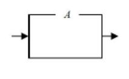 | 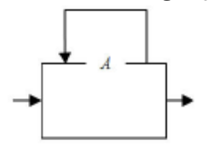 | 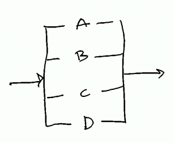 |

#### Recursion in *Ableitungsbaum*

Example `r <= b | Ar`:

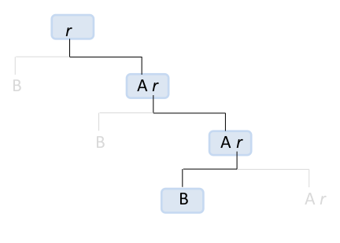 $\implies$ AAB is legal

### Java

#### *Keyword* that cannot be used as *Bezeichner*

```java
abstract	default		if				private			this
boolean		do			implements		protected		throw
break		double		import			public			throws
byte		else		instanceof		return			transient
case		extends 	int				short			try
catch		final		interface		static			var
char		finally		long			strictfp		void
class		float		native			super			volatile
const		for new		switch			while
continue	goto		package			synchronized
```

####  Special characters

- `\t` tab
- `\n` new line
- `\"` double quotes
- `\\` backslash

 The forward slash  (`/`)  is not a special character, `"\/"` gives error.

#### *Primitive types*

Seen in class:

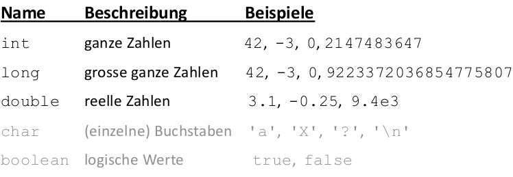 

| Type e range |         `int`         |              `long`              |
| ------------ | :-------------------: | :------------------------------: |
| From         | $-2^{31}=-2147483648$ | $-2^{63} = -9223372036854775808$ |
| To           | $2^{31}-1=2147483647$ | $2^{63}-1= 9223372036854775807$  |

 In order to correctly define a `long` type value out of the `int` range, you have to put a **`L`** at the end of the number.

####  Operations

  **Be careful with module!** Some special cases:

```java
-1%2; // gives -1, not 1!!
1%7; // gives 1
230857%10; // gives 7, in general, %10^n is useful to get the n last digit of a number.
230857%2; // gives 1, in general, %2 is useful to check whether a number is even/odd (0 even, 1 odd).
2.5%1.5; // gives 1.0 (double)! % is also defined for double!
```

#### Scanner

The scanner is in `java.util.*` .

How to create a scanner with input from the console:

```java
Scanner name = new Scanner(System.in);
```

#### Increment and decrement

##### Post-Inc/Decrement

```java
int x=2;
int y;
y=x++; //*
```

The following happens:

```java
//*: 
int temp = x;
x=x+1;
y=temp; 
```

##### Pre-Inc/Decrement

```java
int x=2;
int y;
y=++x; //*
```

The following happens:

```java
//*: 
x=x+1;
y=x;
```

#### *off-by one* error, or *Zaunpfahlproblem*

Example: `1, 2, 3, 4, 5,`, or `,1 ,2 ,3 ,4, 5`

#### Strings

`s.toUppercase` returns the string uppercase, but it doesn't modify `s` (`s` remains lowercase).

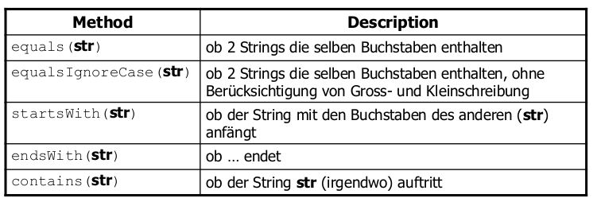 

#### Class `Random`

`java.util.Random`:

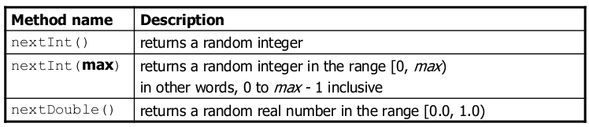 

#### *Scope (Sichtbarkeitsbereich)*

The variables are visible inside the code block where they get declared (`{ //CodeBlock }`).

Example: 

```java
for (int i = 1; i <= 100; i++) {
	System.out.print("/");
}
for (int i = 1; i <= 100; i++) { // OK
	System.out.print("\\");
}
int i = 5; // OK: outside of loop's scope
```

#### Array

`new int[number]` gets initialized with zeros, `new String[number]` (and in general every object) with `null`s.

 To compare two arrays, both `.equals()` and `==` couldn't be used. You can instead use `Arrays.equals(a1,a2)` from class `java.util.Arrays`!

`Arrays.toString(a)` converts the array `a` into a string.

It is also possible to create an array with 0 dimensions: ` int[] a = new int[0]`.

#### Value Semantics vs. Reference Semantics

An object variable (like array's variable) is only used to access to an object, and it is not the object itself (*reference semantics*), unlike primitive type variables (*value semantics*). For example:

```java
int[] myArray = new int[] {0,1,2};
myArrayCopy = myArray;
myArray = null;
// myArrayCopy is still {0,1,2}, whereas:
myArray = myArrayCopy;
myArray[1]=18;
// myArrayCopy and myArray are {0,18,2}
```

Furthermore, the changes that happens in another method remains visible even after the method gets called, unlike primitive type variables. For example:

```java
public static void main(String[] args) {
    int[] myArray = {0,1,2};
    int k = 1;
	changeMyArray(myArray,k);
    // myArray is {0,18,2}, whereas k is still 1
}

public static void changeMyArray(int[] input, int number) {
    input[1] = 18;
    number = 39;
}
```

#### Classes and objects

 To compare two objects you have to use `.equals()` and not `==` !

`null` is used to delete the reference of a variable to an object (any object, as strings, arrays too).

##### Clients

> Klienten sind alle die Programme die Exemplare einer Klasse erstellen oder auf Exemplare zugreifen (können) [z.B. weil sie als Parameter übergeben wurden] 

##### Implicit parameter

> Impliziter ("implicit") Parameter: Das Objekt für das die Methode aufgerufen wird.

For example in `a.update()`, `a` is the implicit parameter.

##### `toString()` method

It is used to define how to convert an object into a string. The default implementation returns the memory addressof the object.

##### Objects construction and initialization

A constructor has the following structure ( the output type must not be specified!):

```java
class Foo {
	public Foo(TypeOne ParamOne, TypeTwo ParamTwo [,...]) {
		// code in the constructor
	}
}
```

  The variables has to be declared outside the constructor, otherwise they're visible only inside of it.

##### `this`

`this` can be used in order to avoid the *shadowing* (*Verdecken von Variablen*) (when an object variable has the same name as a parameter), as well as to call the constructor, by using  `this()`. This can be useful to recycle a constructor in a different variant without parameters, avoiding redundancy. For example:

```java
public class Point {
    private int x;
    private int y;
    public Point() {
        this(0, 0); // calls (x, y) constructor
    }
    public Point(int x, int y) {
        this.x = x;
        this.y = y;
    }
    ...
}
```

#####  `static` methods

The `static` methods don't refer to an object, but to the class instead. For example: `Class.method()` for a `static method`. 

They are mainly used to avoid redundancy between different classes (so that there's no need to redefine them).

#####  `static` variables

They work in a similar way as the methods, but **you have to be careful**.

`static` variables are the same for each class' object!

`static` variables must be either `private` or `final` too.

#### Handle files

The `File` (`java.io.File`) class allows to operate on files. Here's a list of methods:

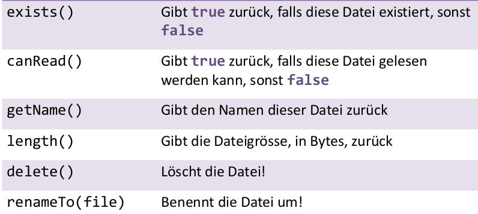 

To read the content of a text file you can put the file object as parameter when creating a scanner:

```java
import java.io.*; // für File
import java.util.*; // für Scanner

File file = new File("input.txt");
Scanner scanner = new Scanner( file );
int zahl = scanner.nextInt();
```

#### *Exception*s

The exceptions can be "caught" (by `catch`, see below), in order to define how to define how the program should react when these exceptions happen.

Some exceptions must be "caught" from the program, because the Java system is not able to handle them correctly. Other exceptions are recognized by the system (for example division by 0, `null` pointer,...).

The exceptions that are recognized and handled by the system are called ***checked Exception***, the others are ***unchecked Exception***.

It is possible to declare that an exception can happen inside a method, by using the keyword `throws`  after declaring the method:

```java
public static void foo(...) throws type
```

#### Input/Output

`Scanner` has two exceptions: `NoSuchElementException` and `InputMismatchException`.

You can use `.hasNext[Type]()` to verify if there's an element right after the cursor.

The scanner can also be used with a string as parameter. This can be very useful to read each line (using  `.nextLine()`) from a text file, for example:

```java
String text = "15 3.2 hello 9 27.5";
Scanner scan = new Scanner(text);
```

##### Output - `PrintStream` class

It is in`java.io`.

It has methods similar to `System.out`, but it writes in a file instead. Here's an example:

```java
import java.io.*;

File file = new File("example.txt");
PrintStream output = new PrintStream(file);
output.print("Hello world!");
```

 **Warnings**

1.  If the file already exists, it gets overwritten.

2. Never use the same scanner for both *Token* and lines, there's a risk to get empty strings. For example:

   ```java
   input.nextInt(); // output: 23
   "23\t3.14\nJoe\t\"Hello\" world\n\t\t45.2 19\n"
      ^
   input.nextDouble(); // output: 3.14
   "23\t3.14\nJoe\t\"Hello\" world\n\t\t45.2  19\n"
            ^
   input.nextLine(); // output: "" (empty!)
   "23\t3.14\nJoe\t\"Hello\" world\n\t\t45.2  19\n"
              ^
   input.nextLine(); // output: "Joe\t\"Hello\" world"
   "23\t3.14\nJoe\t\"Hello\" world\n\t\t45.2  19\n"
                                    ^
   ```

#### How variables get saved  

- the ***static data*** contains the informations for the Java virtual machine (they're not relevant for the programmer and they have nothing to do with the keyword `static`)
- the ***heap*** contains the objects that gets created by the `new` operator
- the ***stack*** contains the variables used inside methods (for example parameters).

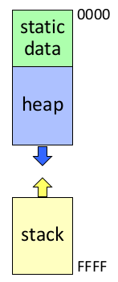 The stack grows upwards, whereas heap downwards.

##### Example

```java
public void run() {
    Rational a = new Rational(1, 2);
    Rational b = new Rational(1, 3);
    Rational c = new Rational(1, 6);
    Rational sum = a.add(b).add(c);
    println(a + " + " + b + " + " + c + " = " + sum);
}
```

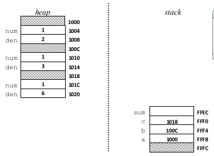

If there are too many variables/objects, the stack and the heap can get overwritten. Java returns in this case an error (`StackOverflowError`, often happens when there are too many recursions).

If there are areas of the *heap* that don't get pointed by the stack, the *garbage collector* frees these areas.

#### *Package*

If we make an analogy between class and file, the package represents the folder.

For example a class `D` from package  `a.b.c` must be saved in the file `a/b/c/D.java`.

If no package is specified, Java automatically inserts the program inside the *default* package, from which classes can't get imported and can't be used in other packages.

In this lectures we ony use the default package.

##### *Default* (visibility)

By using the `default` keyword , the package is only visible inside the class and all the other classes inside the same package. A variable gets put in the default package if you don't write anything before its declaration. For example:

```java
package pacman.model;
public class Sprite {
    int points; // default: visible to pacman.model.*
    String name; // default: visible to pacman.model.*
}
```

##### *Nested classes*

It is possible to create classes inside other classes, for example:

```java
public class Inner2 {
    public static void main(String[] args) {
        System.out.println(new InnerClass().foo);
    }
    static class InnerClass {
        int foo = 2;
    }
}
```

####  Inheritance (*Vererbung*) 

The keyword`super` can be used to point to the parent class, for example `super.getSalary()` inside `Administrator extends Angestellte` calls `Angestellte.getSalary()`.

##### Constructors

When you define a constructor inside the superclass, you have also to define it for the subclasses.  **The subclasses don't inherit constructors**.

The superclass constructor, can be called using `super(...)`.

 `private` from superclasses **can't** be read from the *subclasses*! In order to access them, you have to use an accessor and access to them with `super.get...()` (or use the `protected` attribute instead, discussed later).

##### Selective (objects') behavior *(Selektiv Verhalten von Objekten)*

the *override* can be used to change the behavior of a method that is used inside another method of the subclass. For example:

```java
public class Angestellte {
    private int years;
    public Angestellte(int initialYears) {
        years = initialYears;
    }
    public int getVacationDays() {
        return 20 + getSeniorityBonus();
    }
    // vacation days given for each year in the hospital
    public int getSeniorityBonus() {
        return 2 * years;
    }
}


public class FaGe extends Angestellte {
    public FaGe(int years) {
        super(years); 
    }
    // FaGe don't get extra vacation for their years of service.
    @Override
    public int getSeniorityBonus() {
        return 0;
    }
}
```

In this case calling  `faGe.getVacationDays()` with a `FaGe` object, `getSeniorityBonus()` returns `0`.

This phenomenon is called *dynamic binding* (*dynamische Bindung*).

##### The `protected`  attribute

This attribute allows the subclasses to access the superclass' protected variables, maintaining the property that they are not accessible outside the class (like `private`).

##### Error hierarchy

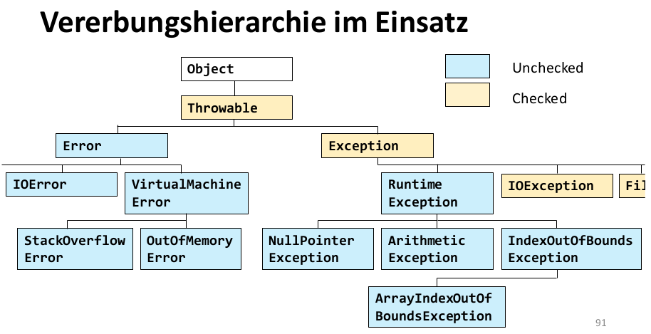

##### The `Object` class

Every new defined class is (by default) a `Object` subclass.

Inside the `Object` class it is defined the method `equals` that can be overridden with another method defined inside the new class, so that you can use it to verify if to objects are the same. For example:

```java
public boolean equals(Point other) {
	return (x == other.x && y == other.y);
}
```

Here we have the problem that this method can only get `Point` objects as parameters. For this reason we need a ***cast***.

##### *Cast*

The *cast* allows you to change the class (if there's the right relationship of "parent/child" between the two classes).

To verify if a cast is possible, you can use the `instanceof` operator. If the output is `true`, then is possible to make the *cast*.

If you use a cast to pass from a subclass to a superclass, it can also be implicit. For example:

```java
class A {}
class B extends A {}

A b = new B();
B x;
x = b; // Doesn't work! The cast goes to the subclass, hence it must be explicit.
x = (B) b; // Correct
b = (A) x; // Correct, but it's not necessary to explicit the cast
b = x; // Correct (implicit)

```

#### Polymorphism (*Polymorphismus*)

A programm is written in a way that allows to use it with different types of objects and adapt its behaviour depending on these object types.

##### Class visibility

If you insert the `public` keyword before `class`, the class must be in a file with the same name as the class. If this keyword is not inserted, the visibility will be default, hence only inside the same package.

##### Dynamic binding (*dynamische Bindung* )

If you define a reference variable like `SuperClass variable = new SubClass()`, you can access to every method defined in the *superclass*, but they get executed as defined inside the subclass. This doesn't happen if the methods are `private`. For example:

```java
class T {
    void s0(){ 
        m();
    }
    void s1(){}
    void s2(){}
    void m(){}
}

class S extends T {
    @Override
    void s1() {
    	m();
    }
    @Override
    void s2() {
    	p();
    }
    void p() {
        System.out.print("S");
    }
}

class R extends S {
    @Override
    void p() { 
        System.out.print("R");
    }
}
```

If you define `T r = new R()`, when you call `r.s2()` you obtain `R`, because `s2()` will be executed as defined inside `S` class, and  `p()` as defined in `R` class. **Please note** that `r.p()` can't be called, because `p()` is not defined in `T`.

 If the two methods `p()`are `private`,  then the result would be **`S` and not `R`**! This is because `p()` of `R` is not visible by `S`.

To override a method, the new method must be equal or less restrictive (in terms of visibility) then the method of the superclass, otherwise you'll get an error.

##### *Shadowing*

Unlike methods, variables sometimes don't get overridden. Usually a method takes the variables as defined inside the class. The use of variables with same names inside subclasses is discouraged. Here's an example:

```java
class X {
	String s = "in X";
    String myS() {
    	return s;
    }
    
    String myS1() {
        return s;
    }
}

class Y extends X {
    String s = "in Y";
    @Override
    String myS() {
  	  return s;
    }
}

Y yref = new Y();
yref.s; 					// returns "in Y"
yref.myS(); 				// returns "in Y"
yref.myS1(); 				// returns "in X"
((X) yref).myS(); 			// returns "in Y"
((X) yref).s; 				// returns "in X"

```

##### *Overloading*

The *overloading* allows you to define more methods with the same name but with different parameters, so that the right method gets called depending on which parameters are inserted when we call that method. Here's an example:

```java
class A {
    String foo(X xref) {
    	return "foo 0 A";
    }
}
class B extends A {
    String foo(X xref) {
        return "foo 0 B";
    }
}
class C extends B {
    String foo(Y yref) {
    	return "foo 0 C";
    }
}

A a = new A();
B b = new B();
C c = new C();
X x = new Y();
Y y = new Y();

a.foo(y); //foo 0 A, because Y extends X
b.foo(x); //foo 0 B
c.foo(x); //foo 0 B!! Since foo() in C takes a Y variable as parameter, it can't take x (explicit cast is needed), therefore foo() gets executed from class B, which takes an X variable as parameter.
```

#### *Interfaces*

The problem about inheritance (`extends`) is that each subclass can have at most one superclass.

We use *interfaces* to solve this problem. Unlike inheritance, they represent similar behaviors between classes (same methods).

 When a method gets implemented, it **must** be with **public** visibility!

If a class doesn't implement every method declared in the interface, Java will raise an error. But if you want to implement just some methods, than you can define the class as `abstract` (`public abstract class ...`).

When you use the `abstract` keyword, you can't create new object using the keyword `new`, the abstract class must be implemented in another class.

It is also possible to extend interfaces with other interfaces (inherit interfaces).

#### *Exceptions*

 **Pay attention** to the `catch` blocks' order.. The one about the more restrictive exception must come before and the less restrictive at the end.

##### Generic programming (*Generische Programmierung*)

For each primitive type there's a corresponding class called *wrapper class* (*Wrapper Klasse*), which can be obtain by writing the first letter uppercase (but **`Character`** for `char` and **`Integer`** for `int`!).

The change from a primitive type to the corresponding wrapper it's automatic and it is called *boxing*.

A new object of `Integer`  type can be crated using the method  `valueOf(int number)`, for example `Integer i = Integer.valueOf(5)` creates an `Integer i`  of value `5`. It is possible to get the value of an object `Integer` by using the methods `intValue()`  or `doubleValue()`.

  When you do a boxing and you want to compare two values, it is better to use `.equals()`.

##### `compareTo()`

`compareTo()` can be use to compare two objects by defining an order relation (as seen in DiskMat). The return value is less or greater then `0` or equal to `0`  depending on the order of the two objects (or if they are the same in the order).

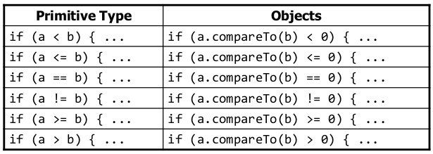

To order a collection you can use the method `sort()` from the  `Collections` class (in which there are other useful methods to handle the collections). This method can be used only if the `compareTo()` method from the `Comparable` interface is defined inside the class of the collection type. I.e. a `Collection<E>` must implement `Comparable`, by defining the `compareTo(E other)` method. In this way it will be possible to use `Collection.sort()`.

Sometime when implementing the `compareTo()` method it is useful make a subtraction between the two values, but you have to be careful when working with`double` types variables, in this case it is better to use `Math.signum(double)`.

`compareTo()` is consistent (*konsistent*) if $\forall$ `a`, `b`: `((a.compareTo(b)==0)==(b.compareTo(a)==0))`. It is recommended to have it consistent.

##### `Collections` framework 

Three main important interfaces: `List`, `Map` and `Set`.

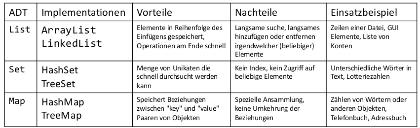

Pros and cons between the different implementation:

| ADT    | Implementation                                               | Order                                                        | Pros                                                         | Cons                                                         |
| ------ | ------------------------------------------------------------ | ------------------------------------------------------------ | ------------------------------------------------------------ | ------------------------------------------------------------ |
| `List` | `ArrayList`  <br /><br /><br /><br /><hr />`LinkedList`      | as inserted<br /><br /><br /><br /><hr /> as inserted        | Accessing an element (`get()`, `set()`, ...) requires $\mathcal{O}(1)$ <br /><hr>Adding an element at the beginning of the list is in $\mathcal{O}(1)$ | Adding an element at the beginning of the list is in $\mathcal{O}(n)$<br /><hr>Accessing an element (`get()`, `set()`, ...) requires $\mathcal{O}(n)$ |
| `Set`  | `TreeSet`<br /><br /><br /><hr />`HashSet`<br /><br /><br /><hr class="dashed">`LinkedHashSet` (`extends HashSet`) | ascending (with `CompareTo()`)<br /><hr />not defined<br /><br /><br /><hr class="dashed"> as inserted | Extracting min(/max) requires $\mathcal{O}(1)$ <br /><hr />Almost all  operations are in $\mathcal{O}(1)$ <hr class="dashed"> Like `HashSet` (almost) and elements ordered | Searching an element requires $\mathcal{O}(\log n)$ <hr> The elements don't have a defined order<hr class="dashed"> A bit less efficient than `HashSet` |
| `Map`  | `TreeMap` <hr> `HashMap`<hr class="dashed">`LinkedHashMap`   | See above                                                    | See above                                                    | See above                                                    |

##### `Iterator`

With a *foreach* cycle, of the form `for(E e : set){}` each `e` value is *read-only*, hence you're not allowed to delete the element in the set. to solve this problem you can use the iterators. The `Iterator` interface contains three methods:

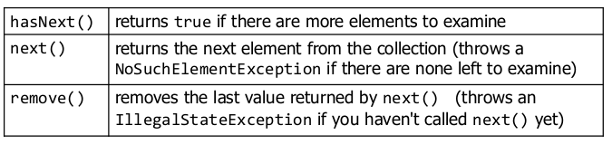

Here's an example of its use:

```java
Iterator<Integer> itr = scores.iterator();
System.out.println(scores); // [38, 43, 72, 87, 94]
while (itr.hasNext()) {
    int score = itr.next();
    
    // eliminate any failing grades
    if (score < 60) {
        itr.remove();
    }
}
System.out.println(scores); // [72, 87, 94]
```

#### Systematic programming

You write a *postcondition* only if you're sure that the program can reach that point (if there aren't any exceptions before).

##### *Hoare triple* (*Hoare Tripel*)

A *hoare triple* is made of a *precondition* `P`, a *statement(s)* (*Anweisung[en]*) `S`, and a *postcondition* `Q`: `{P} S {Q}`. The triple is valid iff.:

​	`P` is valid before the execution of `S` $\implies$ `Q` is valid after the execution of `S`.

###### Assignment (*Zuweisung*)

To verify the validity of a postcondition with an assignment in `S` you can define a `Q'` by substituting variables in `Q` with their respective definition in `S`. Then you have to verify that `P` $\implies$ `Q'`.

**Example**

```java
{z != 1}
	y = z*z;
{y != z}
```

In this case `Q'` is `{z*z != z}`, we can show that `P`  $\not\!\!\!\!\implies$`Q'` (for example for `z=0`), hence the triple is not valid.

###### Sequences of statements (*Folgen von Anweisungen*)

To verify the hoare triple `{P} S1;S2 {Q}`, you have to verify if there's a statement `R` such that:

1. `{P} S1 {R}` is valid **and**
2. `{R} S2 {Q}` is valid

**Example**

```java
{z >= 1}
	y = z+1;
//R
	w = y*y;
{w > y}
```

In this case `R` is `{y > 1}`, because in that case `{z >= 1} y = z+1; {y > 1} ` and `{y > 1} w = y*y; {w > y}` would be both valid.

###### `If`-*statement*

You have to verify that the postcondition is true whatever if-block the program execute. More formally we have that the hoare triple `{P} if b S1 else S2 {Q}` is valid iff.:

1. `{P && b} S1 {Q1}` is valid **and**
2. `{P && !b} S2 {Q2}`  is valid **and**
3. `(Q1 || Q2) ` $\implies$ `Q`

**Example**

```java
{true}
if (x > 7) { y = x; }
else { y = 20; }
{y > 5}
```

- Let `Q1` be `{y > 7}`, and `Q2` be `{y == 20}` (also other statements can work here).
- With the assignment rules we can say that
  - `{true && x > 7} y = x; {y > 7}` is valid and
  - `{true && x <= 7} y = 20; {y == 20}` is valid
- Furthermore, `(y>7 || y==20)` $\implies$ ` y>5`

Hence the triple is valid.

###### Weakest precondition (*"Schwächste" Vorbedingung*)

- `P1` is stronger *(stärker)* than `P2` $\overset{\text{def.}}{\iff}$ `P1` $\implies$ `P2`
- `P1` is weaker (*schwächer*) then `P2` $\overset{\text{def.}}{\iff}$`P2` $\implies$ `P1`

The goal is to find the weakest precondition (`wp(S1;S2;...,Q)`) and the strongest postcondition so that we can always substitute them with something stronger or weaker respectively.

###### Find `wp(S1;S2;...,Q)`

To find `wp(S1;S2;...,Q)` you have to start from `Q` and go backward to `S1`. In case there's an if-statement  you have to do a case distinction; you have that `wp(if b S1 else S2, Q)` is `(b && wp(S1,Q)) || (!b && wp(S2,Q))`.


  **Be careful** when variables with the same name swap!


##### Loop

For loops you can use the invariant , which, always holds, not matter how many times the loop repeat. For an invariant `I` and a loop condition `B` , the triple is valid iff $\exists$ `I` such that:

1. `P` $\implies$ `I`  the invariant holds at the beginning (outside the loop)
2. `{I && B} S {I}` After one loop iteration the invariant still holds
3. `(I && !B)` $\implies$ `Q` The invariant and the fact that the loop condition is false (hence the loop ends) implies the postcondition `B`

##### Termination (*Terminierung*)

###### In loops

You usually show that  a program terminates by assigning a positive integer number to the loop state (after ending each iteration), so that at each step the number decrease. By showing that this number reaches 0 when the loop condition is false, you prove that the loop has a finite number of cycles that bring the number to 0.

**Example**

You can show that a loop that goes through every element of a `LinkedList` terminates by stating that the size of the uncovered list becomes smaller at each iteration, hence it will get to 0, therefore the loop terminates.

###### In a recursion

You can show that a recursion terminates in a inductive way:

1. Show that the base case is correctly handled
2. Show that each recursive call work on a problem which is strictly smaller then the current problem
3. Show that, assuming each recursive call correctly solves the subproblem, this method correctly solve the current problem ("induction step")

##### Liskov substitution principle

> Let $\phi (x)$ be a property provable about objects $x$  of type $T$. Then $\phi (y)$ should be true for objects $y$ of type $S$ where $S$ is a subtype of $T$.

from [wikipedia](https://en.wikipedia.org/wiki/Liskov_substitution_principle)

##### Heuristic for planning

1. Identify the classes
2. Elaborate the connections between classes
3. Attributes 
4. Methods

Repeat these steps multiple times.


